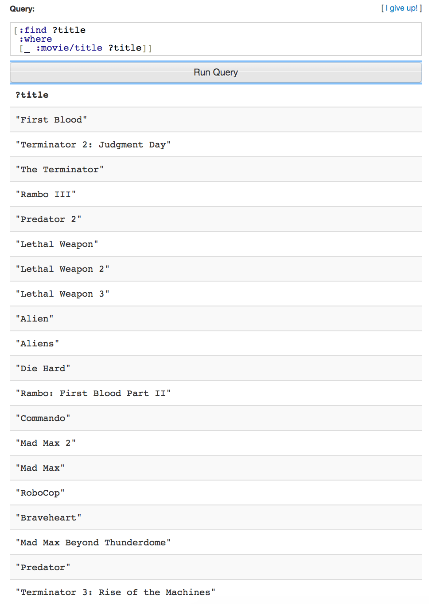
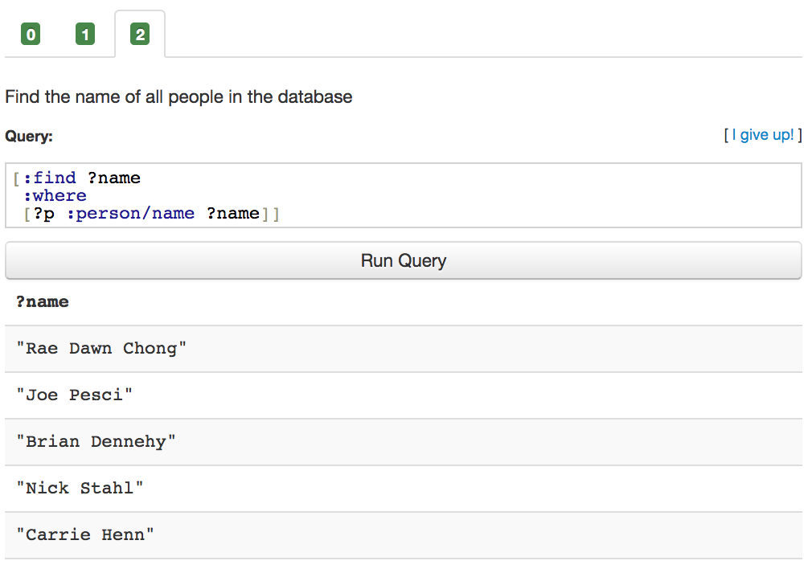
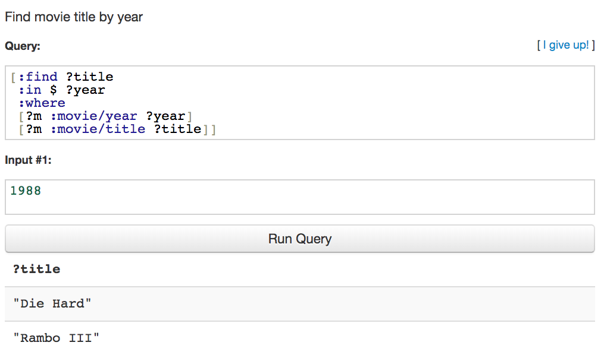

# Datalog language learning.

### ***Summary***

As I followed the tutorial to practice and get into knowing how datalog language works, interestingly I found it is more convenient and concise than SQL.


**I follow '[LearnDatalogToday](http://www.learndatalogtoday.org/)' tutorial to practice.*** 

> **Learn Datalog Today** is an interactive tutorial designed to teach you the [Datomic](http://datomic.com/) dialect of [Datalog](http://en.wikipedia.org/wiki/Datalog). Datalog is a declarative **database query language** with roots in logic programming. Datalog has similar expressive power as [SQL](http://en.wikipedia.org/wiki/Sql).
>
> Datomic is a new database with an interesting and novel architecture, giving its users a unique set of features. You can read more about Datomic at [http://datomic.com](http://datomic.com/) and the architecture is described in some detail [in this InfoQ article](http://www.infoq.com/articles/Architecture-Datomic).


### 1.1 Extensible Data Notation

>In Datomic, a Datalog query is written in [extensible data notation (edn)](http://edn-format.org/). Edn is a data format similar to JSON, but it:
>
>- is extensible with user defined value types,
>- has more base types,
>- is a subset of [Clojure](http://clojure.org/) data.
>
>
>
>Edn consists of:
>
>- Numbers: `42`, `3.14159`
>- Strings: `"This is a string"`
>- Keywords: `:kw`, `:namespaced/keyword`, `:foo.bar/baz`
>- Symbols: `max`, `+`, `?title`
>- Vectors: `[1 2 3]` `[:find ?foo ...]`
>- Lists: `(3.14 :foo [:bar :baz])`, `(+ 1 2 3 4)`
>- Instants: `#inst "2013-02-26"`
>- .. and a few other things which we will not need in this tutorial.


***Practice:*** "Find all movies titles in the database"

```
[:find ?title
 :where
 [_ :movie/title ?title]]
```

| element                  | type    |
| ------------------------ | ------- |
| :find                    | keyword |
| ?title                   | symbol  |
| :where                   | keyword |
| [ _ :movie/title ?title] | vector  |

***Result:***




### 1.2 Basic Queries

> You can think of the database as a flat **set of datoms** of the form:
>
> ```
> [<e-id>  <attribute>      <value>          <tx-id>]
> ...
> [ 167    :person/name     "James Cameron"    102  ]
> [ 234    :movie/title     "Die Hard"         102  ]
> [ 234    :movie/year      1987               102  ]
> [ 235    :movie/title     "Terminator"       102  ]
> [ 235    :movie/director  167                102  ]
> ...
> ```
>
> A query is represented as a vector starting with the keyword `:find` followed by one or more **pattern variables** (symbols starting with `?`, e.g. `?title`). After the find clause comes the `:where` clause which restricts the query to datoms that match the given **data patterns**.
>
> For example, this query finds all entity-ids that have the attribute `:person/name` with a value of `"Ridley Scott"`:
>
> ```
> [:find ?e
>  :where
>  [?e :person/name "Ridley Scott"]]
>  
>  //'_' can be used as a wildcard
>  
>  [:find ?e
>  :where
>  [?e :person/name "Ridley Scott" _]]
>  
>  //So, the above two queries are equivalent
> ```


***Practice1:*** Find the entity ids of movies made in 1987

```
[:find ?e
:where
[e? :movie/year 1987]]
```


***Practice2:*** Find the entity-id and titles of movies in the database

```
[:find ?e ?title
 :where
 [?e :movie/title ?title ]]
```


***Practice3:*** Find the name of all people in the database

```
[:find ?name
 :where
 [?p :person/name ?name]]
```

***Result3:***




### 1.3 Data patterns

>In the previous chapter, we looked at **data patterns**, i.e., vectors after the `:where` clause, such as `[?e :movie/title "Commando"]`. There can be many data patterns in a `:where` clause:
>
>```
>[:find ?title
> :where
> [?e :movie/year 1987]
> [?e :movie/title ?title]]
>```
>
>he important thing to note here is that the pattern variable `?e` is used in both data patterns. When a pattern variable is used in multiple places, the query engine requires it to be bound to the same value in each place. Therefore, this query will only find movie titles for movies made in 1987.
>
>The order of the data patterns does not matter.


***Practice1:***  Find movie titles made in 1985

```
[:find ?title
 :where
 [?e :movie/year 1985]
 [?e :movie/title ?title]]
```


***Practice2:*** What year was "Alien" released?

```
[:find ?year
 :where
 [?m :movie/title "Alien"]
 [?m :movie/year ?year]]
```


***Practice3:*** Who directed RoboCop? You will need to use `[<movie-eid> :movie/director <person-eid>]` to find the director for a movie.

```
[:find ?name
 :where
 [?m :movie/title "RoboCop"]
 [?m :movie/director ?p]
 [?p :person/name ?name]]
```


***Practice4:*** Find directors who have directed Arnold Schwarzenegger in a movie.

```
[:find ?name
 :where
 [?p :person/name "Arnold Schwarzenegger"]
 [?m :movie/cast ?p]
 [?m :movie/director ?d]
 [?d :person/name ?name]]
```


### 1.4 Parameterized queries

> query with an input parameter for the actor
>
> ```
> [:find ?title
>  :in $ ?name
>  :where
>  [?p :person/name ?name]
>  [?m :movie/cast ?p]
>  [?m :movie/title ?title]]
> ```
>
> Tuples: A tuple input is written as e.g. `[?name ?age]` and can be used when you want to destructure an input. Let's say you have the vector `["James Cameron" "Arnold Schwarzenegger"]` and you want to use this as input to find all movies where these two people collaborated
>
> Collections: You can use collection destructuring to implement a kind of logical **or** in your query. Say you want to find all movies directed by either James Cameron **or** Ridley Scott
>
> Relations: a set of tuples - are the most interesting and powerful of input types, since you can join external relations with the datoms in your database.


***Practice1:*** Find movie title by year

```
[:find ?title
 :in $ ?year
 :where
 [?m :movie/year ?year]
 [?m :movie/title ?title]]
```

***Result1:***



****


***Practice2:*** Given a list of movie titles, find the title and the year that movie was released.

```
[:find ?title ?year
 :in $ [?title ...]
 :where
 [?m :movie/title ?title]
 [?m :movie/year ?year]]
```


***Practice3:*** Find all movie `?title`s where the `?actor` and the `?director` has worked together

```
[:find ?title
 :in $ ?actor ?director
 :where
 [?a :person/name ?actor]
 [?d :person/name ?director]
 [?m :movie/cast ?a]
 [?m :movie/director ?d]
 [?m :movie/title ?title]]
```

process:

1. input actor and director seperately
2. find actorID and directorID based on name
3. find movieID related to the actorID and directorID
4. find movie title based on movieID


***Practice4:*** Write a query that, given an actor name and a relation with movie-title/rating, finds the movie titles and corresponding rating for which that actor was a cast member.

```
[:find ?title ?rating
 :in $ ?actor [[?title ?rating]]
 :where
 [?a :person/name ?actor]
 [?m :movie/cast ?a]
 [?m :movie/title ?title]]
```

process:

1. find actorID based on actor name
2. find movieID based on actorID
3. find movieID based on title


### 1.5 More queries

> A datom, as described earlier, is the 4-tuple `[eid attr val tx]`. So far, we have only asked questions about values and/or entity-ids. It's important to remember that it's also possible to ask questions about attributes and transactions.
>
> 
>
> Attributes: For example, say we want to find all attributes that are associated with person entities in our database. We know for certain that `:person/name` is one such attribute, but are there others we have not yet seen? [attributes are also entities in our database!]
>
> 
>
> Transactions:It's also possible to run queries to find information about transactions, such as:
>
> - When was a fact asserted?
> - When was a fact retracted?
> - Which facts were part of a transaction?
> - Etc.
>
> The transaction entity is the fourth element in the datom vector. The only attribute associated with a transaction (by default) is `:db/txInstant` which is the instant in time when the transaction was committed to the database.


***Practice1:*** What attributes are associated with a given movie.

```
[:find ?attr
 :in $ ?title
 :where
 [?m :movie/title ?title]
 [?m ?a]
 [?a :db/ident ?attr]]
```


***Practice2:*** Find the names of all people associated with a particular movie (i.e. both the actors and the directors)

```
[:find ?name
 :in $ ?title [?attr ...]
 :where
 [?m :movie/title ?title]
 [?m ?attr ?p]
 [?p :person/name ?name]] 
```

***Practice3:*** When was the seed data imported into the database? Grab the transaction of any datom in the database, e.g., `[_ :movie/title _ ?tx]` and work from there.

```
[:find ?inst
 :where
 [_ :movie/title _ ?tx]
 [?tx :db/txInstant ?inst]]
```


### 1.6 Predicates

> So far, we have only been dealing with **data patterns**: `[?m :movie/year ?year]`. We have not yet seen a proper way of handling questions like "*Find all movies released before 1984*". This is where **predicate clauses** come into play.


***Practice1:*** Find movies older than a certain year (inclusive)

```
[:find ?title
 :in $ ?inputYear
 :where
 [?m :movie/title ?title]
 [?m :movie/year ?year]
 [(<= ?year ?inputYear)]]
```


### 1.7 Transformation functions

> **Transformation functions** are pure (= side-effect free) functions or methods which can be used in queries to transform values and bind their results to pattern variables. Say, for example, there exists an attribute `:person/born` with type `:db.type/instant`. Given the birthday, it's easy to calculate the (very approximate) age of a person:
>
> ```js
> (defn age [birthday today]
>   (quot (- (.getTime today)
>            (.getTime birthday))
>         (* 1000 60 60 24 365)))
> ```


***Practice1*:** Find people by age. Use the function `tutorial.fns/age` to find the age given a birthday and a date representing "today".

```
[:find ?name
 :in $ ?age ?today
 :where
 [?p :person/name ?name]
 [?p :person/born ?born]
 [(tutorial.fns/age ?born ?today) ?age]]
```


***Practice2:*** Find people by age. Use the function `tutorial.fns/age` to find the age given a birthday and a date representing "today".

```
[:find ?name ?age
 :in $ ?today
 :where
 [?p :person/name "Bruce Willis"]
 [?p :person/born ?sborn]
 [?p2 :person/name ?name]
 [?p2 :person/born ?born]
 [(< ?sborn ?born)]
 [(tutorial.fns/age ?born ?today) ?age]]
```


***Practice3:*** The birthday paradox states that in a room of 23 people there is a 50% chance that someone has the same birthday. Write a query to find who has the same birthday. Use the `<` predicate on the names to avoid duplicate answers. You can use (the deprecated) `.getDate` and `.getMonth` java `Date` methods.

```
[:find ?name-1 ?name-2
 :where
 [?p1 :person/name ?name-1]
 [?p2 :person/name ?name-2]
 [?p1 :person/born ?born-1]
 [?p2 :person/born ?born-2]
 [(.getDate ?born-1) ?d]
 [(.getDate ?born-2) ?d]
 [(.getMonth ?born-1) ?m]
 [(.getMonth ?born-2) ?m]
 [(< ?name-1 ?name-2)]]
```


### 1.8 Aggregates

> Aggregate functions such as `sum`, `max` etc. are readily available in Datomic's Datalog implementation. They are written in the `:find` clause in your query:
>
> An aggregate function collects values from multiple datoms and returns
>
> - A single value: `min`, `max`, `sum`, `avg`, etc.
> - A collection of values: `(min n ?d)` `(max n ?d)` `(sample n ?e)` etc. where `n` is an integer specifying the size of the collection.


***Practice1:*** count the number of movies in the database

```
[:find (count ?m)
 :where
 [?m :movie/title]]
```


***Practice2:*** Find the birth date of the closet person in the database

```
[:find (min ?date)
 :where
[_ :person/born ?date]] 

// confused with '_' here
```

