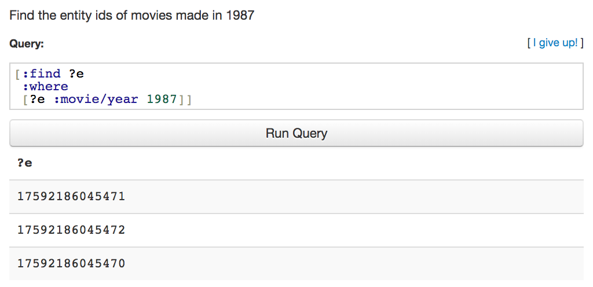
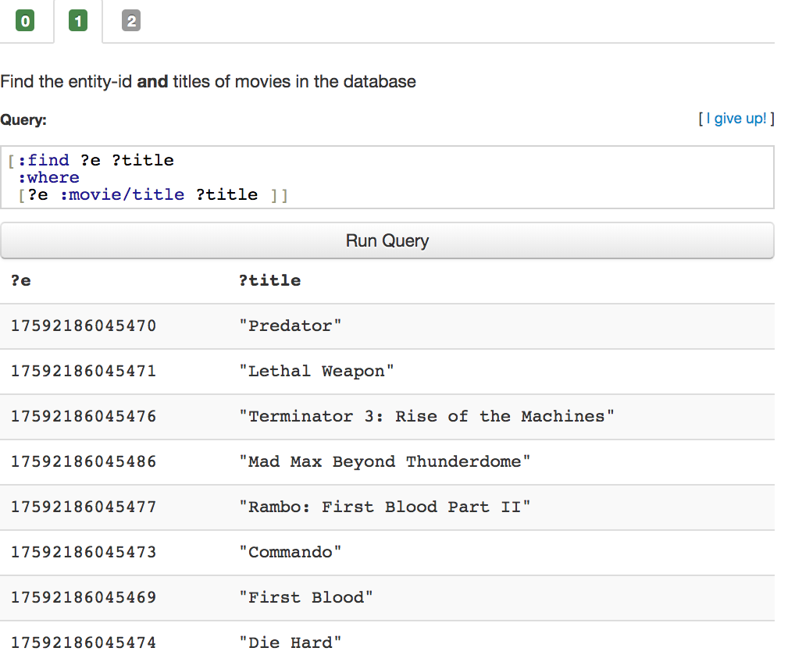

# Datalog language learning.

***I follow '[LearnDatalogToday](http://www.learndatalogtoday.org/)' tutorial to practice.*** 

> **Learn Datalog Today** is an interactive tutorial designed to teach you the [Datomic](http://datomic.com/) dialect of [Datalog](http://en.wikipedia.org/wiki/Datalog). Datalog is a declarative **database query language** with roots in logic programming. Datalog has similar expressive power as [SQL](http://en.wikipedia.org/wiki/Sql).
>
> Datomic is a new database with an interesting and novel architecture, giving its users a unique set of features. You can read more about Datomic at [http://datomic.com](http://datomic.com/) and the architecture is described in some detail [in this InfoQ article](http://www.infoq.com/articles/Architecture-Datomic).


### 1.1 Extensible Data Notation

>In Datomic, a Datalog query is written in [extensible data notation (edn)](http://edn-format.org/). Edn is a data format similar to JSON, but it:
>
>- is extensible with user defined value types,
>- has more base types,
>- is a subset of [Clojure](http://clojure.org/) data.
>
>
>
>Edn consists of:
>
>- Numbers: `42`, `3.14159`
>- Strings: `"This is a string"`
>- Keywords: `:kw`, `:namespaced/keyword`, `:foo.bar/baz`
>- Symbols: `max`, `+`, `?title`
>- Vectors: `[1 2 3]` `[:find ?foo ...]`
>- Lists: `(3.14 :foo [:bar :baz])`, `(+ 1 2 3 4)`
>- Instants: `#inst "2013-02-26"`
>- .. and a few other things which we will not need in this tutorial.


***Example:*** "Find all movies titles in the database"

```
[:find ?title
 :where
 [_ :movie/title ?title]]
```

| element                 | type    |
| ----------------------- | ------- |
| :find                   | keyword |
| ?title                  | symbol  |
| :where                  | keyword |
| [_ :movie/title ?title] | vector  |

***Result:***


### 1.2 Basic Queries

> You can think of the database as a flat **set of datoms** of the form:
>
> ```
> [<e-id>  <attribute>      <value>          <tx-id>]
> ...
> [ 167    :person/name     "James Cameron"    102  ]
> [ 234    :movie/title     "Die Hard"         102  ]
> [ 234    :movie/year      1987               102  ]
> [ 235    :movie/title     "Terminator"       102  ]
> [ 235    :movie/director  167                102  ]
> ...
> ```
>
> A query is represented as a vector starting with the keyword `:find` followed by one or more **pattern variables** (symbols starting with `?`, e.g. `?title`). After the find clause comes the `:where` clause which restricts the query to datoms that match the given **data patterns**.
>
> For example, this query finds all entity-ids that have the attribute `:person/name` with a value of `"Ridley Scott"`:
>
> ```
> [:find ?e
>  :where
>  [?e :person/name "Ridley Scott"]]
>  
>  //'_' can be used as a wildcard
>  
>  [:find ?e
>  :where
>  [?e :person/name "Ridley Scott" _]]
>  
>  //So, the above two queries are equivalent
> ```


***Example1:*** Find the entity ids of movies made in 1987

```
[:find ?e
:where
[e? :movie/year 1987]]
```

***Result1:*** 




***Example2:*** Find the entity-id and titles of movies in the database

```
[:find ?e ?title
 :where
 [?e :movie/title ?title ]]
```

***Result2:*** 




***Example3:*** Find the name of all people in the database

```
[:find ?name
 :where
 [?p :person/name ?name]]
```

***result3:***


